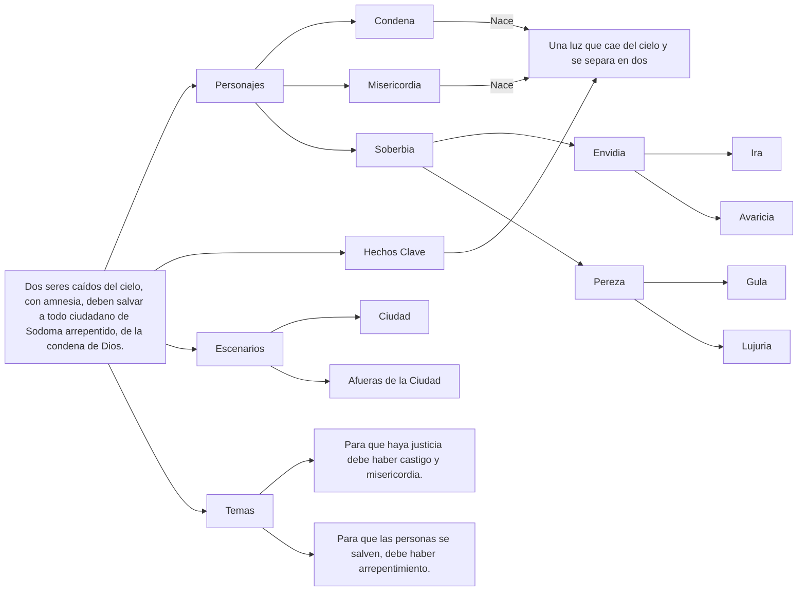

# 📜 Tabla de capítulos y correspondencias simbólicas

| Nº       | Título                    | Tema narrativo                                                                                  | Correspondencia simbólica                                                                                                                                                             |
| -------- | ------------------------- | ----------------------------------------------------------------------------------------------- | ------------------------------------------------------------------------------------------------------------------------------------------------------------------------------------- |
| **I**    | El UNO                    | ¿Qué es el uno? ¿Qué es la verdad? ¿Qué soy si no existiera la verdad?                          | Unidad primordial como orden del todo                                                                                                                                                 |
| **II**   | La Dualidad               | Conflicto entre Condena y Misericordia. Los protagonistas se separan          | Polaridad creadora — el “dos” como tensión necesaria                                                                                                                                  |
| **III**  | La Triada                 | Los protagonistas descubren que quieren liberar a los pobladores de la tiranía de los demonios. | **Tríada**: Se presentan villanos en un orden jerárquico. Dos triadas demoniacas. La misión de los protagonistas sería el equivalente al 1 que unifica la dualidad, completando el 3. |
| **IV**   | Avaricia                  | Derrotar al recaudador de sueños                                                                | Virtud: *Generosidad* — brazo izquierdo - justicia como protagonista. Tema secundario: la justicia, la estabilidad y el orden                                                                                                                  |
| **V**    | Pereza                    | Despertar en la cueva del olvido                                                                | Virtud: *Diligencia* — casco del Megazord - misericordia como protagonista. Tema secundario la familia.|
| **VI**  | Ira                       | Calma al guerrero incendiario                                                                   | Virtud: *Paciencia* — escudo - justicia como protagonista                                                                                                                             |
| **VII**   | Lujuria                   | Purificación del templo corrupto.                                                               | Virtud: *Pureza* — brazo derecho - condena como protagonista. Tema:                                                                                                                     |
| **VIII** | Gula                      | Ruptura del festín eterno                                                                       | Virtud: *Templanza* — pierna izquierda - misericordia como protagonista                                                                                                               |
| **IX**   | Envidia                   | Luz sobre la sombra que roba talentos                                                           | Virtud: *Gratitud* — pierna derecha - justicia como protagonista                                                                                                                      |
| **X**    | Soberbia                  | Caída del tirano que se cree dios                                                               | Virtud: *Humildad* — núcleo del Megazord - justicia y misericordia se unen para vencer al falso creador. Tema secundario: Lo sagrado.                                                                               |
| **XI**   | El Justo en la Tormenta   | Encuentro con Lot, el hombre que resistió                                                       | Prefiguración del éxodo: el “resto fiel”                                                                                                                                              |
| **XII**  | El Cerco de la Ciudad     | Violencia desatada contra los ángeles                                                           | Clímax de corrupción — el “mundo ciego”                                                                                                                                               |
| **XIII** | El Megazord de la Alianza | Unión de los ángeles, luz cegadora                                                              | Integración de las 7 virtudes en un solo cuerpo                                                                                                                                       |
| **XIV**  | El Camino de Fuego        | Escape de Lot y destrucción de la ciudad                                                        | Purificación a través del juicio                                                                                                                                                      |
| **XV**   | El Testimonio del Justo   | Lot transmite la enseñanza                                                                      | Plenitud — **15** como cierre perfecto antes de la expansión                                                                                                                          |

# MAPA MENTAL
