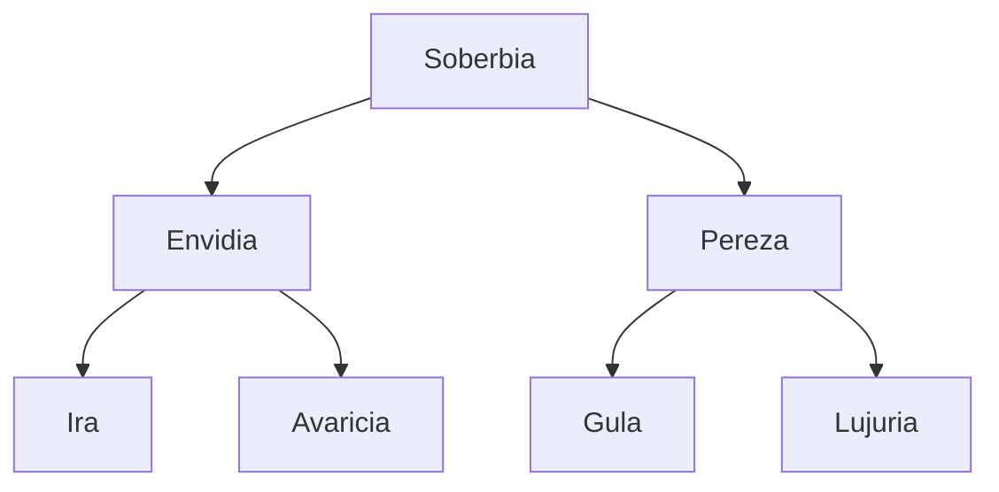

# Heroes
## Pareja Dispareja
### Justicia (Din)
### Misericordia (Rachamin)

## 7 Virtudes

# Villanos
## Leviatán

## 7 Pecados Capitales
serpiente 🐍 = soberbia OK

pavo real🦚 = envidia OK

sapo 🐸 = avaricia

león 🦁 = ira

caracol 🐌 = pereza OK

cerdo 🐖 = gula OK

cabra 🐐 = lujuria OK

