# Niñez :child:
¿Qué es lo que soñaba de niño?

# Manifestar
Convertir algo intangible en algo material.
¿Cómo convertir la imaginación en algo real?

# Cerebro :brain:
El lado izquierdo: analítico.
Derecho: Imaginativo, creativo.

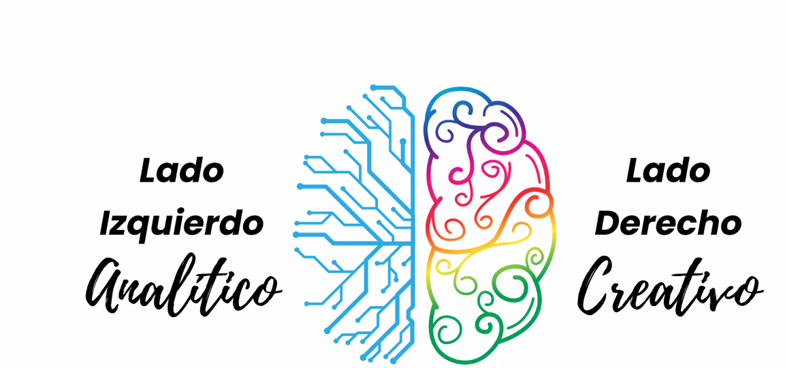

# Física Cuántica ⚛️
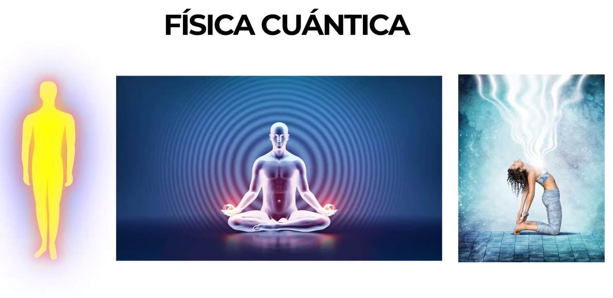
Todos los cuerpos emiten energía. Esa energía se puede medir.
Dicha energía depende de la forma/superficie del cuerpo, características físicas y químicas del cuerpo.
Nuestro cerebro produce ondas. Al cambiar los pensamientos, cambia nuestra energía.
"El campo energético que generamos, cambia con nuestras emociones y pensamientos."
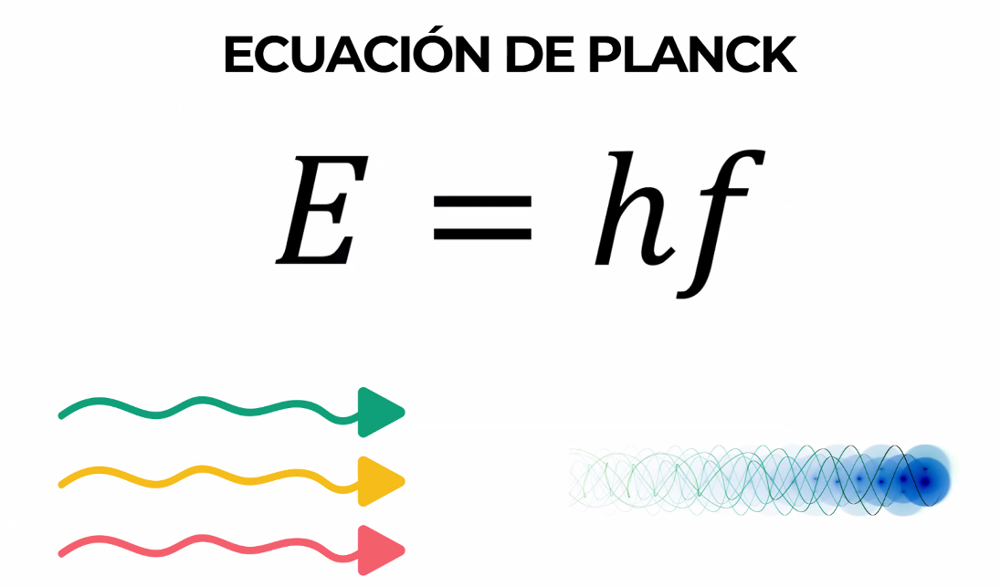
La energía de un fotón es proporcional a su frecuencia (f). h es una constante.
"Eleva tu frecuencia. Cambia tu vibración, para subir tu energía."

Los objetos que vibran a la misma energía se estimulan entre sí.

**Ley de Atracción:** Si tu vibración coincide con la vibración de tu deseo, el mismo se hará realidad.

## Dualidad Onda Particula
Los electrones se comportan tanto como ondas y particulas.
Recomendó investigar más sobre el tema.

# OBJETIVO 🎯
Crear emociones y pensamientos positivos.
Para ello es el tablero conciente.
Tiene que generar mucha alegría, emoción y actitud.
Tiene que hacernos sentir bien.

# NEUROCIENCIA
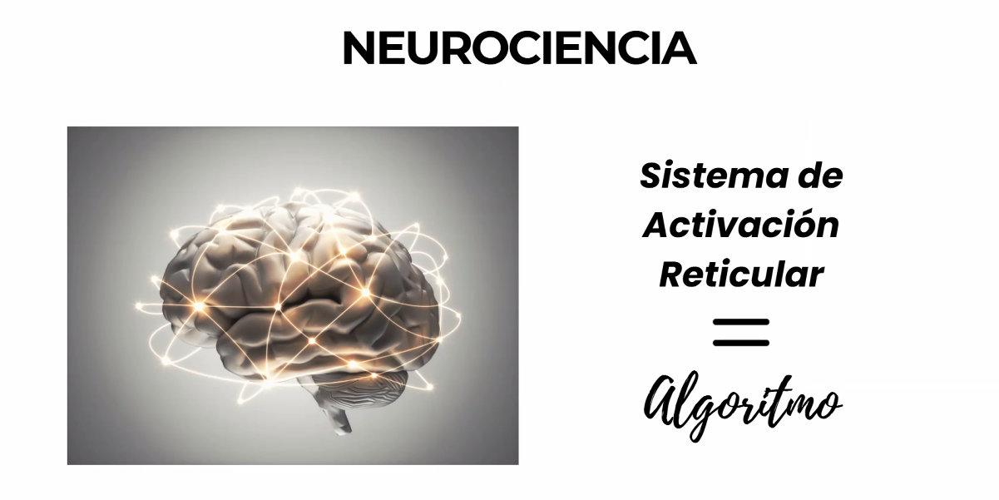
## Sistema de Información Reticular
El sistema de información reticular, busca lo que se le dice que tiene que buscar. Ignora todo lo que no corresponde. Como el experimento del video del gorila que pasa por el medio de las personas que se pasan la pelota entre si.

Hay que decirle a la mente qué es lo que quiero para que las posibilidades aparezcan (como cuando presenté en el Gran Rex simplemente anotándome en la escuela de baile que me llamó la atención).

## Realidad = Ficción
Si al cerebro le decimos que no es posible, no lo va a hacer. Si le decimos al cerebro que es posible, va a buscar la manera (Gran Rex).
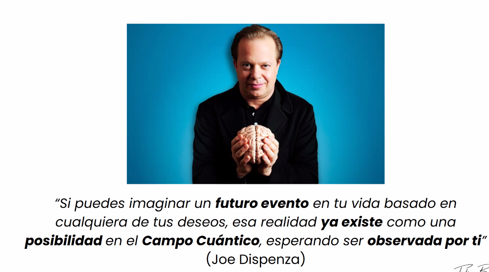
**Nota de Alejandro**: Esta frase hace referencia a cómo el observador altera la probabilidad de que una particula aparezca en una determinada posición.

# SET UP o Configuración
Hay que configurar el tablero.
## Autodiagnóstico
Tengo que trazar un camino. Para ello necesito entender el punto de partida.

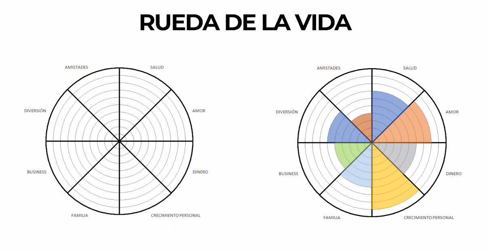

Del uno al 10 poner una escala del 1 al 10 en qué situación estoy e indicar qué tan importantes es cada aspecto para nosotros.
La rueda que vemos coloreada no está equilibrada. Tiene mucho crecimiento personal pero poco en amistades.

### Mi autodiagnóstico
1. **Espiritualidad:** 4. "Tanto como necesito alimento para mi estómago, lo necesito para mi alma." En mis épocas de universitario, estudiaba matemáticas y programación, casi sin un objetivo en particular, más que el mero placer de aprender cosas nuevas. Tanto se me ha impregnado en la mente la idea de ser productivo que ya no pude disfrutar del tiempo libre. ¿Por qué no puedo aprender ciencia por el mero placer del descubrimiento o entender más el mundo que me rodea?.

1. **Familia:** 6. Siento que es susceptible de mejora. No suelo compartir muchos momentos y menos de calidad. Trataré de sonreír más cuando hablo con mis padres.

1. **Salud:** 7. Debo acostarme más temprano y comer mejor. Debo tomar menos café.

1. **Dinero:** 7. Debería comprar más SP 500. Prestar más atención cuando cobro el sueldo. No hay mucho más que pueda ser. Soy medido con los gastos. Debería aprender a gastar más en cosas de mejor calidad y no escatimar en cosas que son importantes.
 
1. **Trabajo y Negocios:** 6. Ciertamente estar 8 horas frente a una computadora no es concordante con el estilo de vida que quiero tener.

1. **Amor:** 4. Estoy soltero. Tengo la creencia limitante de que nunca podré conocer a una mujer que quiera llevar una vida fitness, quiera y pueda tener hijos, que me sienta atraída a ella. Se que es difícil. Tengo las probabilidades en contra. Pero eso no lo puedo controlar yo. Sí puedo aprender a tener una visión más romántica del mundo. A apreciar más las pequeñas cosas de la vida. A sonreír más. A hablar sin filtro. A mostrarme cómo soy y poner entusiasmo.

1. **Diversión:** 5. Como primera medida, cambié de clase de Fusión (principiante-intermedio), a Ritmos Urbanos Básico. Si bien es una clase sencilla, al ser puramente coreográfica, todavía me cuesta un poco. Me divertí mucho más y hasta aprendí pasos nuevos que pude usar para coreografías propias de danza-cardio (ya voy a hacer una franquicia con eso).

1. **Amistades:** 7. Aunque reconozco que no nos vemos muy seguido, siempre que nos re encontramos, parece que nos hubieramos visto ayer. Creo que necesito establecer vínculos más cercanos con aquellas personas con quien comparto actividades en común. La gente del gimnasio, zumba, clásico y ritmos latinos.

## ¿Para qué? 🎯
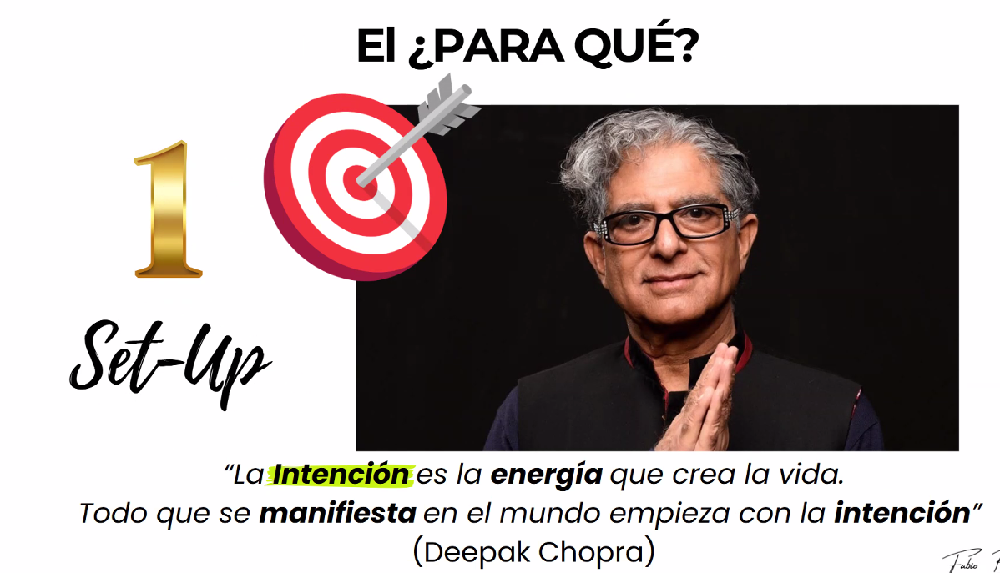
La intención no es el objetivo.
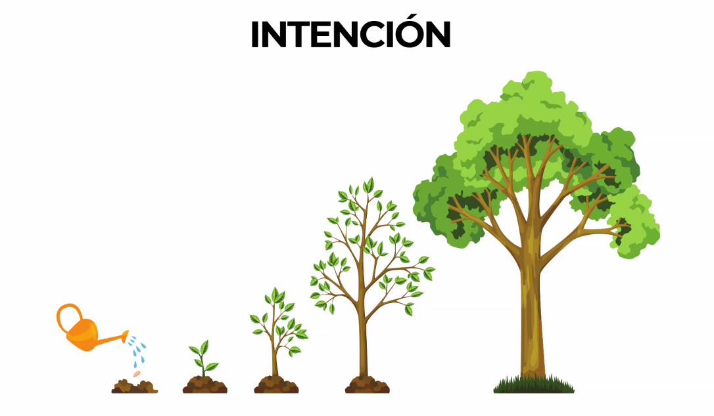
Queremos plantar un árbol, pero si no tenemos claro el  para qué, no sabremos qué semilla plantar.

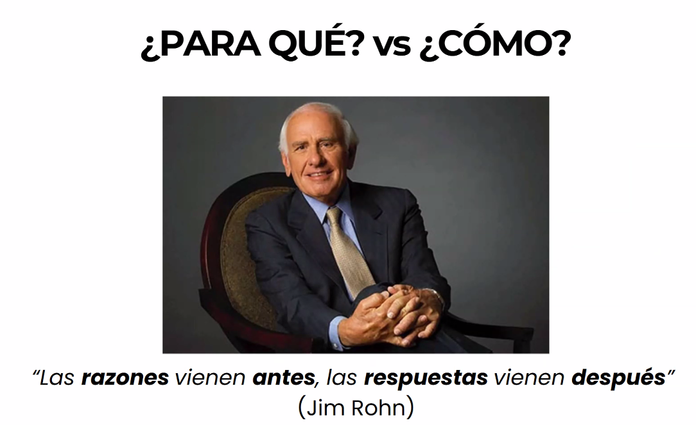
¿Para qué quiero el dinero? ¿Para qué quiero una familia? ¿Para qué quiero una novia? **¿Qué quiero sentir?** Poner foco en eso.

**Quiero sentirme aceptado por quién soy.**

# VISIÓN

Si nuestras áreas de interés son sólo para la salúd y el amor, hacer un tablero específico para ello.

**Usar la intuición:**
Mi intuición me dice que ponga foco en:
- Amor.
- Profesión.
- Salud

Luego de una semana, de meditarlo, noté que la salud y la diversión son los más importante. La paz mental y el sentirme bien, sin dolores en el cuerpo son una prioridad. Quiero sentirme enérgico y sin dolores en el cuerpo.

 

## PPP
Escribir la intención en el presente, positivo y primera persona.

Ejemplo: Yo Ale tengo una salud perfecta. Duermo como Snorlax. No me duele ninguna articulación.

Si quiero una novia, describir bien los valores y personalidad de esa pareja.

Si quieres trabajar de otra cosa pero no sabes cómo...
**¿cómo me quiero sentir en el nuevo trabajo?**

Escuchado. Respetado. Ser una fuente de consulta.
El tablero de visión se convierte más en un tablero de estilo de vida y cómo vivir las emociones.

## Visión -> Guión
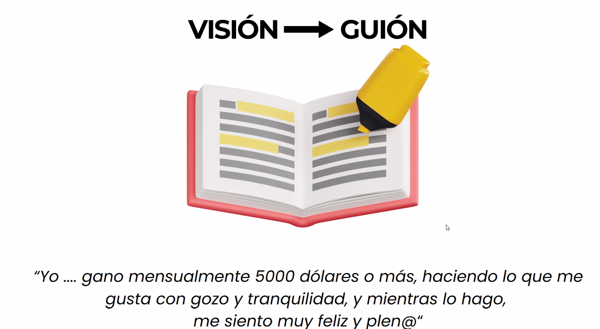
**¿Para qué quiero ganar 5000 dólares por mes?**
¿Quiero irme de vacaciones sin tener que pensar en la plata? ¿Quiero comprar una casa? ¿Quiero ayudar económicamente a mi familia?

Una vez escrito empezar a leerlo en voz alta y grabarlo. Hacerlo con intención. Con emoción.

# CLAVES
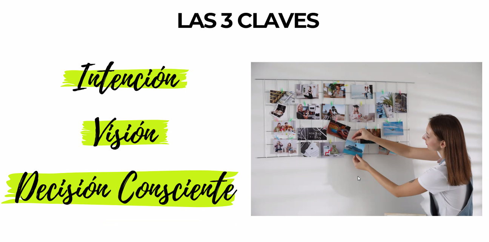

# SINTONIZACIÓN
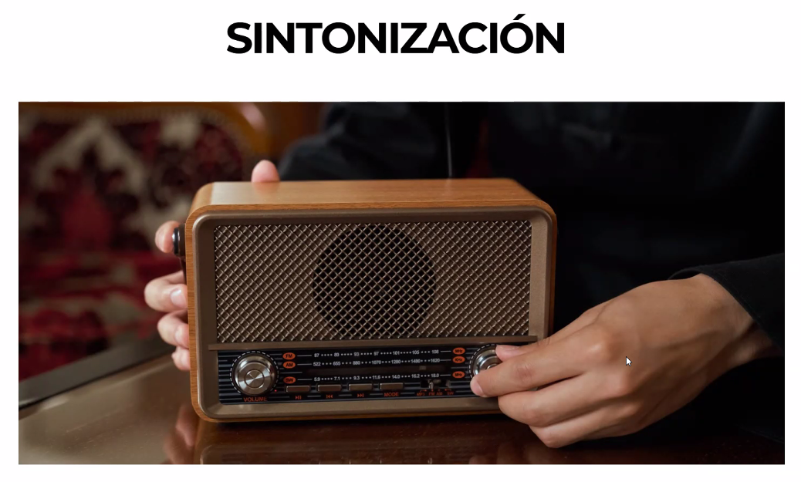

Al igual que cuando uno busca su programa de radio favorito, devemos sintonizar nuestra frecuencia buscada. Debemos vibras a nuestra frecuencia buscada.

**¿Busco una novia o ser amado por quién soy?
¿Busco novia o rodearme de gente que me banque cuando estoy triste? Que valore más quién soy a una caja de chocolate. Que no importa el lugar si no la compañía. Que simplemente sean como son y no que finjar ser otra cosa. Ninguna mujer que se saque la putifoto en el gimnasio y sea un verdadero desastre.**

# CREACIÓN
La autora Marikondo ayuda a las personas a ordenar las casas de las personas a partir de las energías. Busca magnetizar el tablero de visión.

Para crear el tablero, hay que hacerlo sólos. Se recomienda una meditación previa. Que sea un lindo momento y no de prisa.

Se pueden crear imágenes de con IA para el tablero.

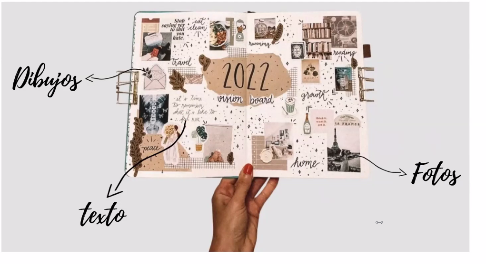

Lo importante del tablero es que lo definan a ustedes.
Cuando uno lo mire tiene que generarnos emociones positivas.

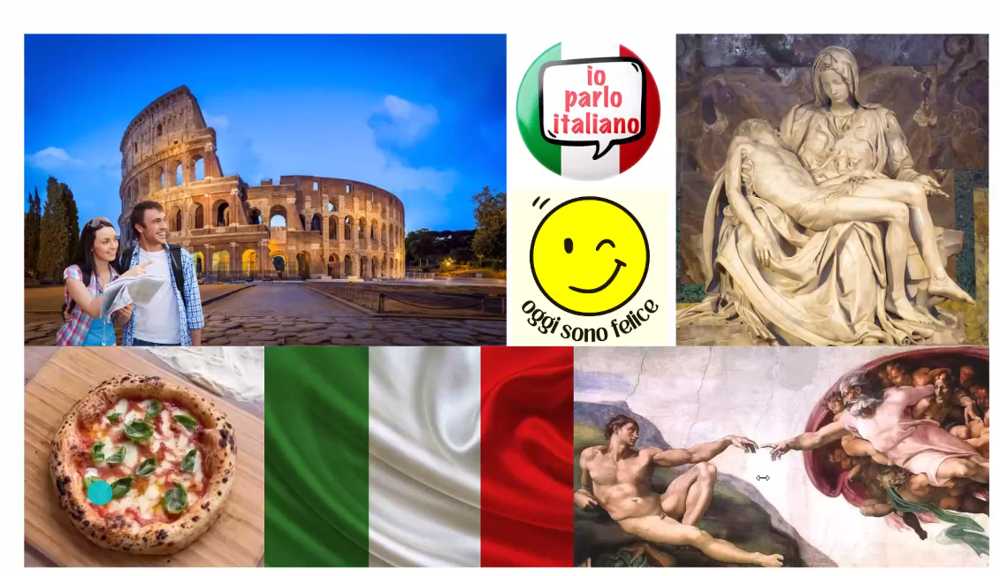
Ejemplo de tablero de un fanático de itália. Puso una foto de él con su pareja frente al coliseo. Para visualizarse a si mismo. A esta persona le gusta el arte y puso obras de arte. Le gusta la pizza italiana y puso eso. Puso "oggi sono felice" (hoy estoy feliz), para transmitir algo positivo.

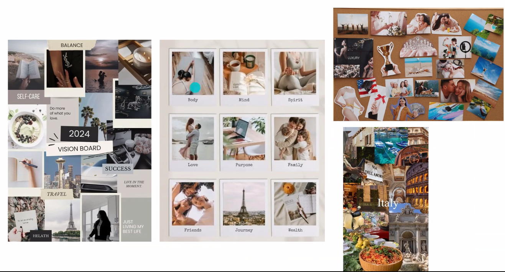
El ejemplo del centro es más estructurado. Bien de ingeniero, con cada aspecto y una foto. Eligió fotos más orientadas al blanco. ¿Transmite orden y tranquilidad?

No se recomienda poner muchas imágenes una sobre otra porque la mente necesita identificar bien las imágenes.

Enviar el tablero hecho. Si se lo envían hasta el 11 de Febrero, lo revisa.

Conviene empezar con fotos propias o dibujos.
Al mostrar fotos tuyas, permite a la mente entender que sí es posible.

Tienen que ser coherente. No podés colocar ser millonario y una foto durmiendo todo el día.

Tiene que ser emocionante y ambicioso.
Si está en tu cabeza. Tiene que estar en tu tablero.

# 4 Claves para Manifestar

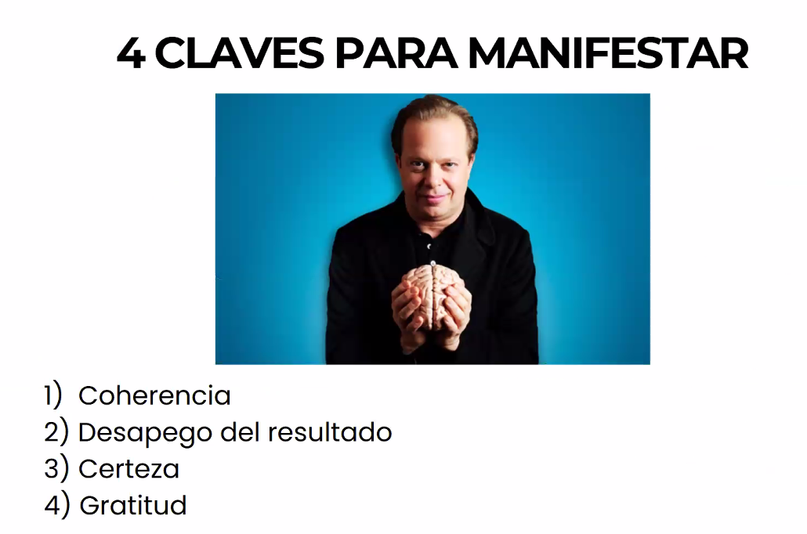

## Coherencia
Entre lo que pienso, siento y actúo.
Tengo muchas ideas y proyectos pero al momento de actuar, me paro.
(Ver el resumen del curso de Cristian).

## Desapego al Resultado
Enfocarse en el proceso más que en el resultado. Es importante poner fechas límites.

## Certeza
Saber que lo vas a lograr. Tenerte fé.

## Gratitud
Agradecer tres veces. Gracias, gracias, gracias. Hecho está, hecho está, hecho está.

# Errores Comunes

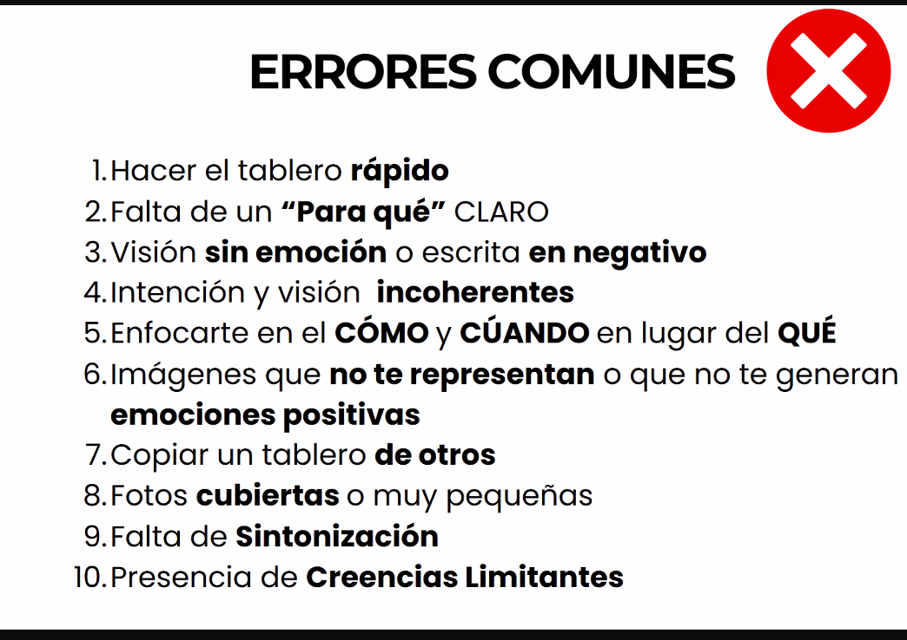

# Creencias Limitantes

## ¿Por qué me parece un problema esta imagen?

## ¿Por qué esto me transmite más seguridad?

## ¿Por qué esto me da envidia? ¿Por qué me parece imposible?

## ¿Sólo para vacaciones?¿Me lo merezco?

## Conciente

La mayoría de las decisiones que tomamos son inconscientes.
En la imagen por fuera está sonriendo pero por dentro su niña interior sufre.

## Deseo vs Realidad

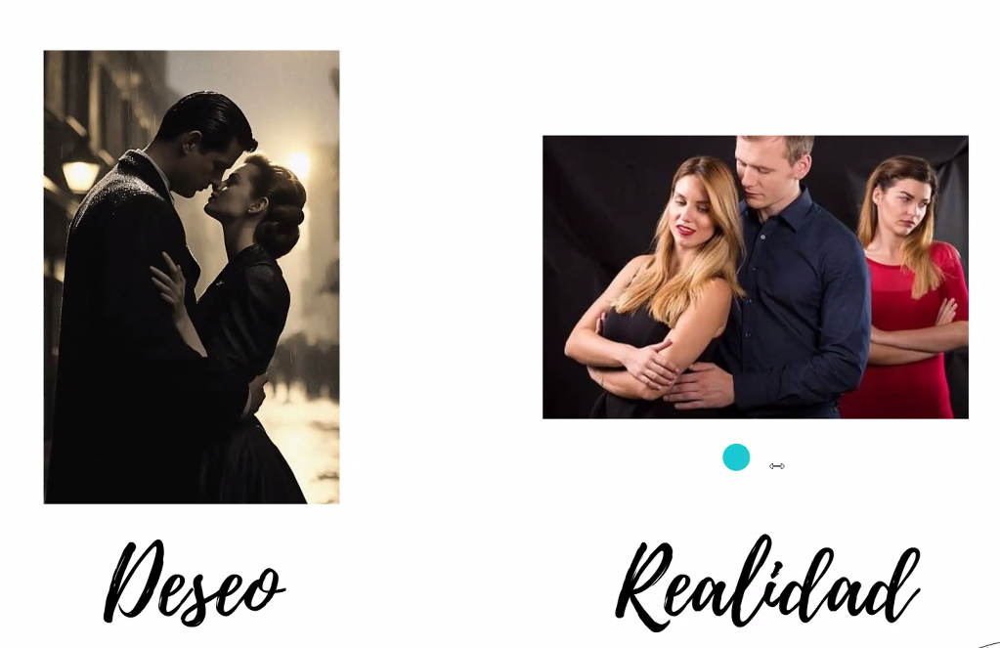
¿Por qué en la imagen de la derecha hay una mujer saliendo con un hombre casado? ¿Cree que realmente no se merece una relación de pareja estable? ¿Por qué le va siempre mal con las relaciones de pareja?

¿Tengo creencias limitantes sobre el dinero?
¿Quiero ser millonario o seguridad?
¿Quiero ser millonario o dejar de trabajar sólo por el dinero?
¿Quiero ser millonario o poder viajar sin necesidad de pensar en lo que gasto?

## Manifestamos lo que creemos
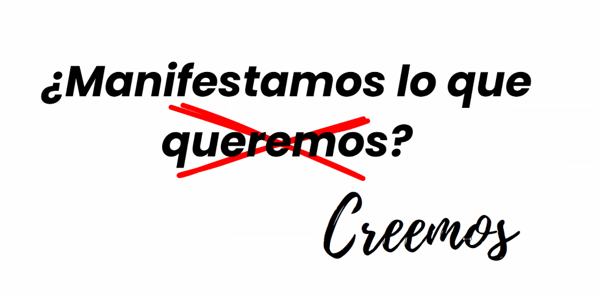
Si en el tablero vemos algo que no cuadra, investigar nuestras creencias limitantes.
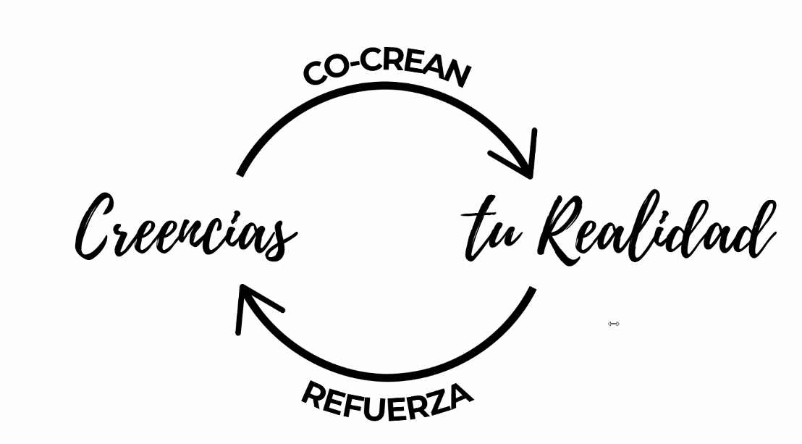

## Reemplazar las creencias limitantes por potenciadoras
¿Cómo sería tu vida si cambiaras tu creencia limitante?
En vez de decir "no soy suficiente", decir "soy suficiente". Ejemplo: Mi trabajo actual. No tuve que aprender nada nuevo. Fui suficiente.
En vez de decir que "todo se consigue con esfuerzo y sufrimiento", decir "todo está servido en bandeja de plata".

# Meditación de Thetahealing
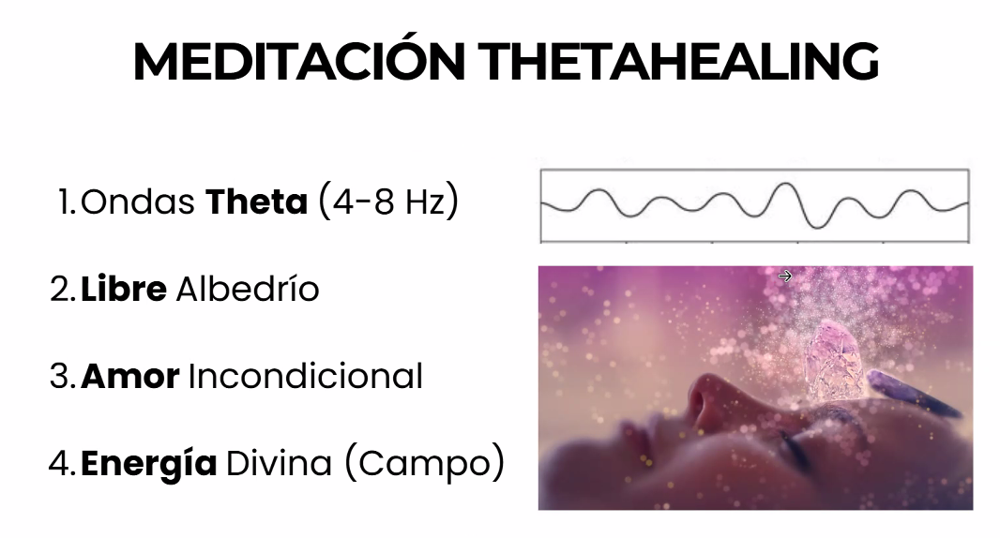
Se generan durante las primeras fases de sueño cuando el conciente e inconciente están más comunicados.

# TIPS ADICIONALES
1- Tiene que ser visualmente accesible pero si alguien lo ve y nos confronta, mejor no mostrarlo.
2- Puede cambiar y evolucionarse constantemente.

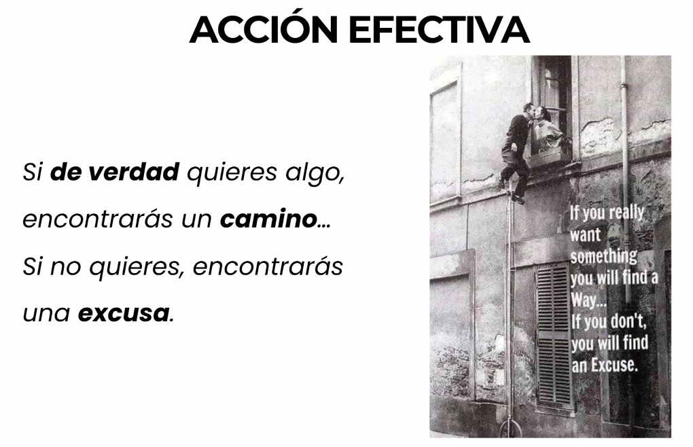
3- Invertir en cambiar nuestras creencias limitantes.
4- Invertir en nuestro desarrollo personal.